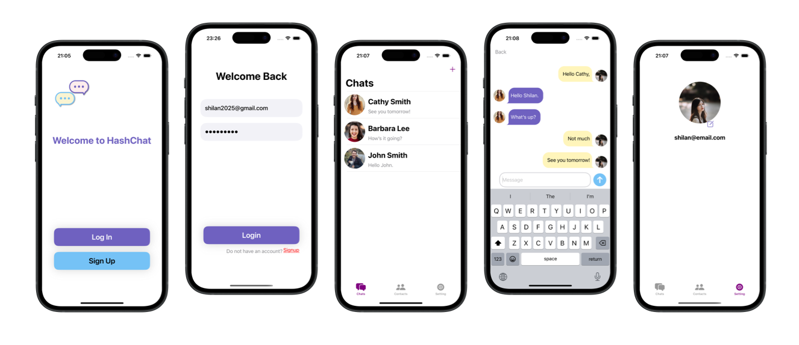
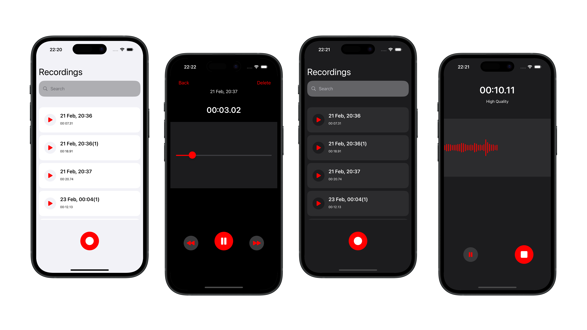
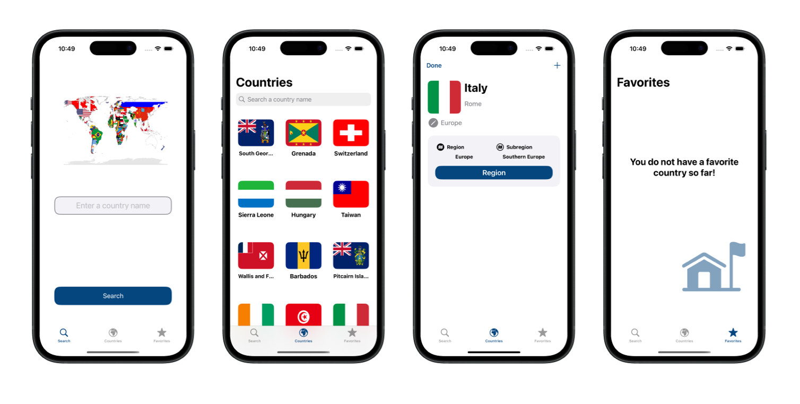

# My Portfolio

Hello! I am Shilan. Here are some of the projects I've worked on while learning and honing my iOS development skills. These projects showcase my progress as I continue to grow as an iOS developer.

**Project Preview** 

##    HashChat

A real-time chat application built with Swift and Firebase that allows users to send messages and manage profiles. HashChat is an ongoing project. While the core functionality is in place, I am continuously working on improvements and adding new features to enhance the user experience.

  
 

**Technologies Used**  
- Swift, UIKit
- Firebase (Auth, Firestore, Storage)
- MVC architectural pattern
- IQKeyboardManagerSwift (via Swift Package Manager)
- Sketch

**Project Preview** 

## Voice Recorder
I implemented this simple voice recorder to gain experience working with the AVFoundation framework. The design of this app is inspired by the Recorder app on Xiaomi phones, but all UI elements were implemented from scratch by me. Its main functionalities—recording, playback, saving, and deleting voice files—are working, but it still requires some refinements. In the future, I plan to add improvements and enhance the project further. 

**Current Challenge:** 
I've implemented a UISliderView in each cell to update progress when a voice memo is played from the main list. However, frequent UI updates sometimes conflict with the play/pause button, causing it to malfunction. I plan to address it in the future.

  
 

**Technologies Used**  
- Swift, UIKit
- AVFoundation framework
- UICollectionViewDiffableDataSource
- UICollectionView compositional layout
- FileManager for persistence locally

**Project Preview** 

## RCInfo
RCInfo is a simple iOS app I developed after completing Sean Allen's Take Home project. It allows users to search for countries and view detailed information, including flags, capitals, regions, and subregions. The app retrieves country data using the REST Countries API.

**Next Possible Improvement:** 
Add the functionality to locate the country on the map by highlighting its borders.

  
 
**Technologies Used**  
- Swift, UIKit
- MVC architectural pattern
- RESTful API:  [REST Countries](https://restcountries.com/#rest-countries)
- UserDefaults for persistence locally

**Features**
- Search for a country by name
- View country flags and essential details
- Save favorite countries for quick access

